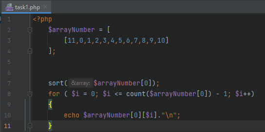
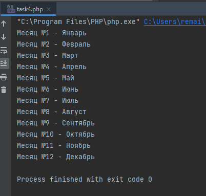
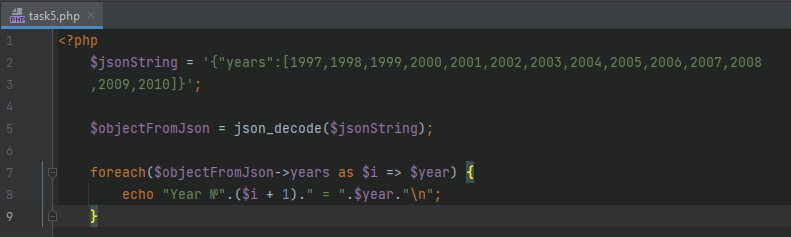

## Menu
### [Task1](#task-1) [Task2](#task-2) [Task3](#task-3) [Task4](#task-4)
### [Task5](#task-5) [Task6](#task-6) [Task7](#task-7)
## Task #1
[go back](#menu)
> PHP: вывести цифры по порядку
> 
> 

Код:



Вывод:


## Task #2
[go back](#menu)
> MySQL: Написать запрос для выборки данных из таблицы, где id = 10 

```SQL
SELECT * FROM table1 WHERE id=10;
```


## Task #3
[go back](#menu)
> PHP: вывести ключи и значения массива
>
> 

Код:


Вывод:


## Task #4
[go back](#menu)
> PHP: вывести месяца года
>
> 

Код:


Вывод:




## Task #5
[go back](#menu)
> PHP: Дана информация в json формате, надо вывести её. <br>
> {"years":[1997,1998,1999,2000,2001,2002,2003,2004,2005,2006,2007,2008
,2009,2010]}

Код:



Вывод:


## Task #6
[go back](#menu)
> PHP и MySQL: Дан код, нужно ответить на вопросы аргументировав
свой ответ

>
> 

1) Будет ли выполнен запрос?<br>Запрос будет выполен при работающем сервисе mysql на той же машине, с которой запускается php код, при пароле рут пользователя = 123, при существовании схемы data и в ней - таблицы users. При несоблюдении одного из условий подключение не может быть установлено.
<br><br>
2) Что сделает запрос?<br>Запрос собирает все столбцы и все строки из таблицы users и помещает информацию в виде объекта в переменную $resultSet
<br><br>
3) Написать запрос для удаления данных, где id пользователей равен одному из данных цифр = 1,2,3,4,5<br>
```SQL
DELETE FROM users WHERE id > 0 AND id < 6;
```


## Task #7
[go back](#menu)
> PHP и HTML: Написать форму с одним полей для ввода текста и
кнопкой, по нажатию которой идёт сохранения данных из поля в файл.

Код html:


Код php:


Результат:


Содержимое log.txt:

